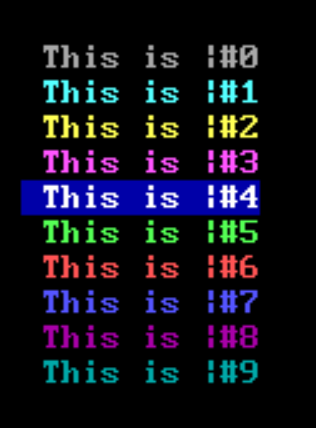

#  Displaying Text
***
## Table of Contents

[TOC]

***
When you logged in, you saw several places where some placeholder messages
were displayed. These messages are all specified in files located at 
```\wwiv\gfiles```. In this directory, there are a number of .MSG and .ANS
files which are the messages and menus displayed you users as they use your
WWIV BBS.

You can customize all of these as you wish. They can be edited with NOTEPAD 
or another text editor. .MSG files are used by default and .ANS files are 
displayed to users if their client supports ANSI. You should definitely have
an ANSI version wherever you want to show off some art or where you can
enhance the look and feel of your board. This is one of the ways you can
make your WWIV BBS your own. 

## Text

WWIV supports multiple ways of displaying text to users.  You may use 
straight ASCII text, ANSI color codes (which most ANSI-BBS terminal programs
support), Traditional WWIV Heart Codes, Extended Editor Heart Codes, or
newer style pipe codes. 


### Heart Codes

Heart codes are the traditional "heart" + number codes that map to one of 
the user-configurable colors defined in the user preferences in WWIV. The
heart is a control-C (aka ascii value #3) and has been around along as WWIV
has. It may be used in any place WWIV is displaying text.


### Customizing User Heart Codes
By using the //COLORS menu option, users can customize how color codes are
displayed to them and only them. For example, by default |#5 is GREEN on
BLACK. A User can change to MAGENTA on WHITE and anywhere |#5 or CTRL-P+5
have been used .MSG files or SUB messages it will display the users chosen
color instead. Here is a screen shot of //COLORS. The character in the cell
is the one you press to customize that color.


### Extended Editor Heart Codes
These are the color codes you can use when posting messages, sending feedback
and email on WWIV BBS. To use
a particular color type CTRL-P + the letter or number that represents the color you want. You can then use 
CTRL-P+0 to return to the default color.


### Pipe Codes

Pipe codes are a newer invention on the BBS scene, only around for 20 years
or so (maybe longer), and is supported by the majority of BBS software still
in existence.  Pipe code support was added to WWIV in 5.0 beta-1 around
October 2002.  It is a implemented as a vertical bar '|' followed by
numbers,letters, or some other characters such as '[' and '{' to implement 
color changes, perform cursor movement perform display manipulation, include
session, user or system information into the output. Pipe codes may be used in
any place WWIV is displaying text to the user in prompts, messages, even 
in .ANS, .B&W and .MSG files.


#### Pipe Color Codes

Two-digit pipe colors are a more widely-accepted "normal" way to define
colors.  If you use them in your messages, they are the most likely to be
displayed properly on other systems that might see them (gated subs, etc).

These are the default 0-9 Pipe colors used in the menu system and other UI 
pages. You uses them by specifying ```|#5``` when you want to start GREEN
and then ```|#0``` to switch back to GRAY. Look in some of the .MSG files
in \wwiv\gfiles for more samples.



Let NN be a 2 digit color code, and 

```|NN ``` is the way to display a pipe code to set the color.

You can stack the foreground and background colors, too.  If you want to have
White on Red, for example, you can use ```|15|20```

| NN | Foreground Color | BackGround Color
|----|------------------|-----------------|
| 00 | Black | 
| 01 | Blue |
| 02 | Green
| 03 | Cyan
| 04 | Red
| 05 | Magenta
| 06 | Brown
| 07 | Gray
| 08 | Dark Gray
| 09 | Bright Blue
| 10 | Bright Green
| 11 | Bright Cyan
| 12 | Bright Red
| 13 | Bright Magenta
| 14 | Yellow
| 15 | White
| 16 | | Black
| 17 | | Blue
| 18 | | Green
| 19 | | Cyan
| 20 | | Red
| 21 | | Magenta
| 22 | | Brown
| 23 | | Gray


#### Pipe Display Macros


WWIV pipe macros are the canonical way to embed system, session and user
information into display text.

Let X be a single digit character, and @ be a literal '@' character

```|@X ``` is the way to display a pipe code macro to display session 
information.

| Code | Information to display |
|------|------------------------|
@~ | Total e-mails and feedbacks sent.
@/ | Today's Date
@% | Time remaining
@# | User number
@$ | File points
@* | WWIV registration num
@- | A$$ points
@! | Display a pause.
@& | status of ANSI or ASCII
@ | Current directory name
@: | Current Message area #
@; | Current File area #
@A | User's age
@a | User' language
@B | User's Birthday
@b | Minutes available in the TimeBank
@C | User's city           
@c | User's country
@D | Number of files downloaded    
@d | User's DSL         
@E | # of E-mails sent
@e | # of network E-mails sent    
@F | # of Feedbacks sent      
@f | Date of first call
@G | # of Messages read       
@g | # of gold                
@I | User's callsIgn
@i | # of Illegal log-ons     
@J | Current message conference name   
@j | Current File conference name
@K | Kb uploaded
@k | Kb downloaded
@L | Date of last call
@l | Total number of logons    
@M | # of e-mail waiting        
@m | # of messages posted
@N | User's name         
@n | Sysop's note        
@O | Times on today
@o | Minutes on          
@P | BBS phone number          
@p | User's phone number
@R | User's real name    
@r | Last baud rate connected      
@S | User's SL
@s | User's street addr. 
@T | User's state        
@t | Current time
@U | # of files uploaded      
@V | # messages in sub   
@X | User's gender
@Y | This BBS Name       
@y | User Computer type  
@Z | User's zip code

#### Pipe Screen and Cursor Control


WWIV pipe screen and cursor codes allow simple display manipulation to be
embedded in text without needing to implement ANSI codes, nor checking for
ANSI support from the user.


```|[nnX ``` is the way to display a pipe code macro to display session 
information.  

In all cases nn is optional and defaults to 1


| Code  | Information to display |
|-------|------------------------|
[nnA    | Moves the cursor up nn lines
[nnB    | Moves the cursor down nn lines
[nnC    | Moves the cursor right nn lines
[nnD    | Moves the cursor left nn lines
[xx;yyH | Goto screen position xx, yy
[K      | Clears the line from cursor position to end of line
[1K     | Clears the line from beginning of line to cursor position
[2K     | Clears the entire line, leaves the cursor position the same
[nnN    | Performs nn newlines (same as bout.nl(nn) in code)


#### Pipe Expression Language


WWIV pipe expression language allows more functions to be executed in the context
of displaying text.  All text that is not part of a string literal (i.e.
enclosed in double quotes) must be lower case.

These are of the format ```|{xxxxx}``` whre xxxxx is the expression text.

| Expression  | Action |
|-------------|------------------------|
set           | sets the next variable to the value that follows.  Example: set pause off
| pause       | displays the system pause.

Set can manipulate the values of several system variables.  The values can be
strings that must be enclosed on double quotes, numbers, or truthy values.  

Truthy values are for true are: 'true', 'yes', 'on'.  Every other value is false.

| Variable    | Meaning |
|-------------|------------------------|
pause         | sets the pause on page on or off
lines         | sets the number of lines displayed, this is used for pause calculation.  Currently only 0 is supported for a value.


Examples:
```
  |{set pause=off}
  |{set lines=0}
  Hello |@N! How are you today?
  |{pause}
```


## Files

Creating new display files is the easiest way to customize your BBS and make
it your own. WWIV supports displaying files at many places throughout the BBS.

### File Extensions For Files

Here are the various file extensions WWIV will look for when displaying a text
file to a user. This is the order in which they are checked, and if one
doesn't exist or isn't applicable to the user because of a constraint
(like color), then the next one in the list will be checked.

| Extension | Description |
|-----------|-------------|
| ans | Used for clients who support ANSI-BBS colors.
| b&w | Used for clients who support ANSI-BBS without color.
| msg | Used fror all clients.  It may contain both heart and pipe codes.  This is the most common type of file extension used in WWIV since colors may be used with both heart or pipe codes.


### File Names
While there are many others, as a new SysOp, the following MSGs are where
you should start.

| FileName   | Description |
|------------|-------------|
chain.msg    | Displayed before listing chains (doors) in the chains menus.
chat.msg     | Displayed in the chat room
editor.msg   | Internal editor help screen
email.msg    | user email menu
feedback.msg | Displayed before sending feedback to the sysop.
logoff.msg   | Displayed after every user logs-off.  Used to say Goodbye, thank them for visiting, suggest another BBS they might visit. 
logon.msg    |  Displayed after every logon. Contains anything you want users to see before they start using the board.  
newuser.msg  | Displayed to new users after they have signed up for the bbs. Use it to thank them for signing up. Point them to anything in particular that is awesome. There is also a new user email, so be brief here.
noansi.msg   | Displayed to users who have clients that do not support ANSI. It should let them users know there are ANSI clients out there they 
smain.msg    | sysop main menu (//sysop)
smain.msg    | sysop menu
sonline.msg  | sysop online command menu
suedit.msg   | sysop menu in user editor
swfc.msg     | sysop menu in WFC
system.msg   | Contains system information to display to your callers.  Displayed after login.msg and after newuser.msg
welcome.msg  | Displayed to every user before they LOGON or start the new user process.  Used to welcome people and show off the style of your board. Usually this has the name of your BBS, A LOGO, other artworks and something to lure people to sign up.  


## Art Tools
[ASCII Art Studio](http://www.torchsoft.com/en/aas_information.html) is a great
tool for making the B&W versions of your .TAG lines, Welcomes, Logons, etc.
Then you can add the color codes in notepad.  
[Pablo Draw](http://picoe.ca/products/pablodraw/) is a great tool for doing full
color ANSI artwork, used by many of the top artists.  

## Old MenuPacks

Old menupacks for WWIV - such as [these](http://www.oocities.org/siliconvalley/pines/2722/#menus) are a 
great place to draw inspiration. *Please note*: The file structure and names of these 
menu sets is different than the current menu system!  


## Known Issues
* Microsoft stopped including [ANSI.SYS](https://en.wikipedia.org/wiki/ANSI.SYS)
  in Windows VISTA.  
  Because there's no ANSI support on some OSes you won't see well rendered ANSI
  on the local system. 
  You'll see all those square brackets and extended ASCII characters.
* Windows 10 includes support for ANSI color codes in cmd.exe again, so you 
  can ```type welcome.ans``` and see the color in welcome.ans.
